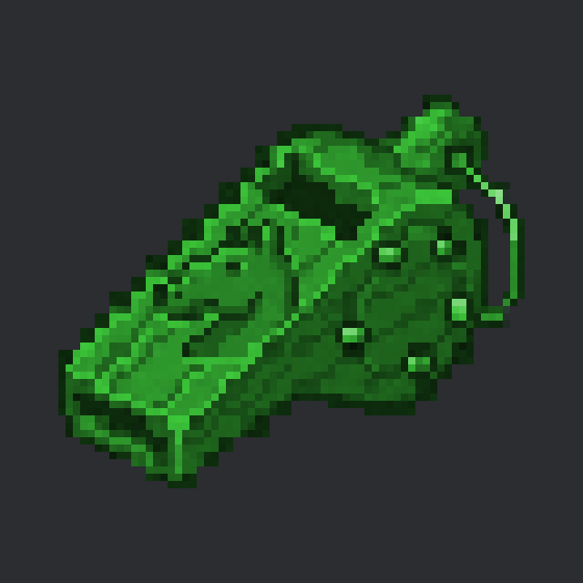
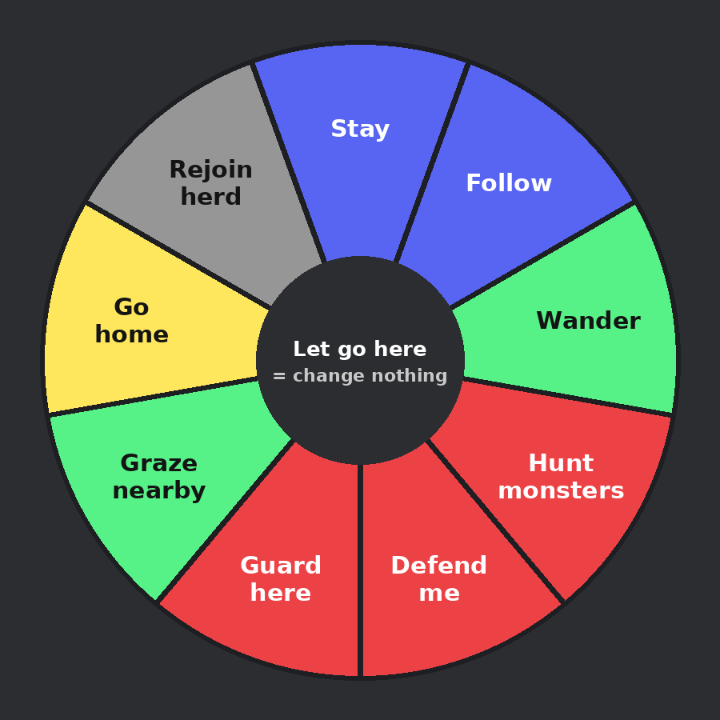
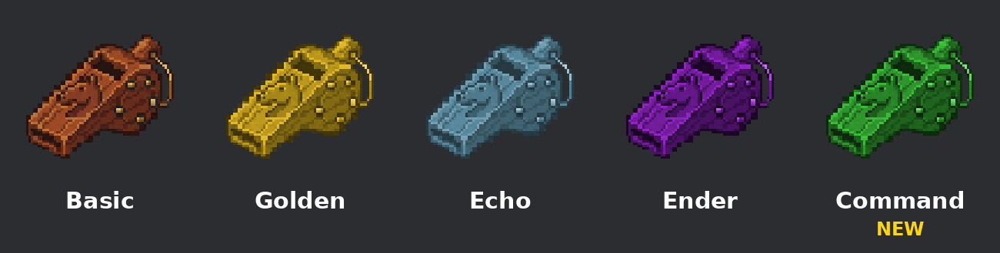

<!--
FOR THE DISCORD BOT. Read this first.
- Written for release 0.5.043 ("the command whistle"). Post the messages in order: each one
  starts at a line reading "MESSAGE n" inside an HTML comment. Each is under 2000 characters
  (Discord's limit).
- Discord cannot show inline markdown images. Upload each file named in an "ATTACH:" line
  with that message (or put it in the embed's image field). The  lines are for
  previewing this file elsewhere; the bot should NOT send them as text.
- Discord markdown only: # ## ### headings, **bold**, *italic*, `code`, > quotes, - lists.
  There are no tables, so none are used here.
- Images live beside this file. order_wheel_diagram.png is a diagram made for this post, NOT
  a screenshot (the wheel has not been seen in a game yet): the real wheel's look and slice
  order may differ. Say so in the caption (message 2 does).
- Release note and full details: https://9-7-8.github.io/Procedural-Horse-Coats/wiki/item-whistles.html
-->

<!-- MESSAGE 1 -->
ATTACH: command_whistle.png

# 🐴 New: the Command Whistle
**Tell your horses what to do. Then they actually do it.**

Until now a whistle could only *call* a horse to you. The **command whistle** gives a horse **standing orders** that it keeps following after you walk away: stay put, follow you, graze near the barn, go home, or even guard you from monsters.

No more horses wandering off the second you turn your back. No more leads and fences just to keep one in place. 🎉

*(Released in version 0.5.043.)*

<!-- MESSAGE 2 -->
ATTACH: order_wheel_diagram.png

## How it works
1. **Sneak** and aim at one of your horses (up to 16 blocks away, not through walls).
2. **Hold right-click.** A wheel of orders opens.
3. **Move the mouse** over an order and **let go** to give it.
4. Let go in the **middle** to change nothing.

*Picture above is a diagram of the nine orders, not a screenshot. The real wheel may look a bit different.*

<!-- MESSAGE 3 -->
## The nine orders
**Everyday**
- **Stay**: stands where you told it. If something frightens it, it can still move, then walks back.
- **Follow**: follows you at a walk and stops a few blocks away. Left behind with no path, it gets brought to you.
- **Wander**: roams freely and ignores you.
- **Graze nearby**: strolls, grazes and eats as it likes, but never more than **12 blocks** from where you left it.
- **Go home**: goes to its stall (or your holding pen) right now, like *Send home*.
- **Rejoin herd**: no order. Back to its normal life.

**Fighters only** ⚔️
- **Hunt monsters**: holds its spot and chases any monster within 16 blocks, then walks back.
- **Defend me**: follows you and charges any monster that comes within 8 blocks of you.
- **Guard here**: stands its ground and kicks any monster within 6 blocks.

<!-- MESSAGE 4 -->
## Good to know
- **Bond matters.** *Stay* and *Follow* need a little bond (bond 31). Everything else needs a stronger one (bond 61). The wheel greys out what a horse can't take and tells you why.
- **Combat orders need a fighter.** Only horses *bred* to fight take them: a monster-hunting **Aggression** pair, **Guardian** x2, or a **Fighter/Champion** magic fighter. Breeders, this is a reason to breed for it!
- **It's a leash, not a chase.** A horse never goes after creepers, players, pets or other tamed horses. It breaks off the fight below **30% health** and goes back to its spot.
- **An order lasts** until you change it, and **never starves a horse**: a hungry horse still goes to eat, and a scared one still bolts.
- **It pauses** while the horse is ridden or on a lead. Calling it with any other whistle, *Send home*, a stasis chamber, selling it, or changing dimension **clears** the order.

<!-- MESSAGE 5 -->
ATTACH: whistle_family.png

## How to get one
- **Craft it:** a **basic whistle** + a **lead** + an **amethyst shard** (shapeless).
- **Or buy it:** from an **equestrian supplier** at level 3 for **5 emeralds**.

Server owners can tune it in `phc/server.toml`: `orders.hunt_radius`, `orders.guard_radius`, `orders.defend_radius`, `orders.graze_radius` and `orders.break_off_health`.

## ⚠️ Fresh out of the oven
The rules and targeting are covered by automated tests, but the wheel, the walking and the fights haven't been played in a game yet. If something looks off, **tell us in this channel** with what you did and what happened. That's exactly the help we need! 🙏

Full guide: https://9-7-8.github.io/Procedural-Horse-Coats/wiki/item-whistles.html
