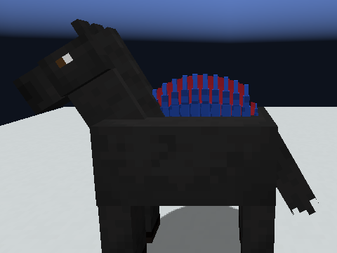
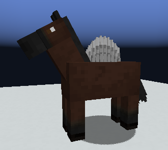
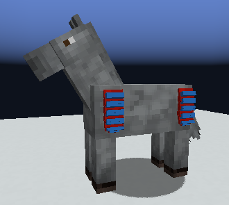
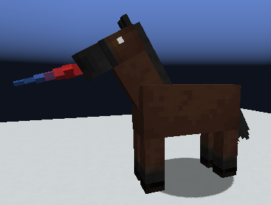
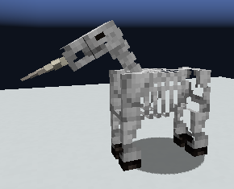

<!--
FOR THE DISCORD BOT. Read this first.
- Written for release 0.5.045 ("spines, sails, plates and a narwhal horn, and less lag").
  Post the messages in order: each one starts at a line reading "MESSAGE n" inside an HTML
  comment. Each is under 2000 characters (Discord's limit).
- Discord cannot show inline markdown images. Upload each file named in an "ATTACH:" line
  with that message (or put it in the embed's image field). The  lines are for
  previewing this file elsewhere; the bot should NOT send them as text.
- Discord markdown only: # ## ### headings, **bold**, *italic*, `code`, > quotes, - lists.
  There are no tables, so none are used here.
- Images live beside this file. All five are real in-game screenshots from the dev client,
  of a horse standing still, cropped to the horse. None is a diagram.
- Release and download: https://github.com/9-7-8/Procedural-Horse-Coats/releases/tag/v0.5.045
-->

<!-- MESSAGE 1 -->
ATTACH: back-sail.png

# 🐴 0.5.045: horses grow new body parts
**Spines, sails, plates and a narwhal horn.**

Some horses now grow four new things: a row of **spines** along the back, a see-through **sail**, bone **plates** over the shoulders and hips, and a **narwhal's spiral horn** out of the muzzle. Each one is a gene, so it passes to foals like the rest, and each has its **own colour gene**.

All four are **rare** in wild horses. Breed for them! 🎉

*(Pictured: a back sail, red membrane with blue spines.)*

<!-- MESSAGE 2 -->
ATTACH: dorsal-spines.png

## Dorsal spines
A row of spines along the back. **One copy is enough** to grow them (dominant). They tuck away under a **saddle** or a **rider**.

## The back sail
Spines with a **see-through membrane** stretched between them. It's **recessive**: two plain-looking horses can have a foal that grows one. Its colour gene sets the membrane one colour and the spines another.

<!-- MESSAGE 3 -->
ATTACH: body-plates.png

## Shoulder and hip plates
Overlapping plates over the shoulders and hips, on both sides: **smooth**, **ridged** or **spiked**. **One copy** grows them. The colour gene sets the plate one colour and its edge another.

<!-- MESSAGE 4 -->
ATTACH: narwhal-horn.png

## The narwhal horn
A long **spiral horn** pointing forward from the front of the muzzle. **One copy** grows it. It's the first form of a new **tusks** gene; boar tusks and sabre fangs come later.

<!-- MESSAGE 5 -->
ATTACH: skeleton-bone-narwhal.png

## 💀 Skeleton horses
The **Great Valley** and **Blackened** skeleton horses can grow all four, in **bare bone**.

## Also in this release
- **Less lag** with lots of horses on screen. A horse no longer rebuilds its coat description every frame, and the horse screens stop re-reading genes every frame.
- **Carts:** a coachman's steering and a reaper cart's harvesting keep working after a world reload.
- The short genetic code only lists a part's colour on a horse that actually **has** that part.
- **Nothing to migrate.** Your worlds load as they are.

<!-- MESSAGE 6 -->
## ⚠️ Fresh out of the oven
These parts have been photographed standing still, but **nobody has watched them on a moving horse**, under tack, or on a foal yet. Their looks are first drafts. If a spine pokes through a saddle or a sail looks odd mid-gallop, **tell us in this channel** with what you saw. That's exactly the help we need! 🙏

Download: https://github.com/9-7-8/Procedural-Horse-Coats/releases/tag/v0.5.045
