<!--
FOR THE DISCORD BOT. Read this first.
- Written for release 0.5.046 ("chests on horses, a storage harness, and eight new things
  to grow"). Post the messages in order: each one starts at a line reading "MESSAGE n"
  inside an HTML comment. Each is under 2000 characters (Discord's limit).
- Discord cannot show inline markdown images. Upload each file named in an "ATTACH:" line
  with that message (or put it in the embed's image field). The  lines are for
  previewing this file elsewhere; the bot should NOT send them as text.
- Discord markdown only: # ## ### headings, **bold**, *italic*, `code`, > quotes, - lists.
  There are no tables, so none are used here.
- Images live beside this file. All twelve are real in-game screenshots from the dev
  client, of a horse standing still, cropped to the horse. None is a diagram.
- Release and download: https://github.com/9-7-8/Procedural-Horse-Coats/releases/tag/v0.5.046
-->

<!-- MESSAGE 1 -->
ATTACH: storage-harness-chest.png
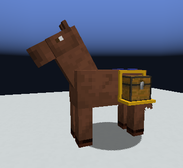

# 🐴 0.5.046: horses carry chests
**Chests on horses, a storage harness, and eight new things to grow.**

Your horse can now carry a **chest on each side**: a chest, a barrel, a shulker box, an ender chest, or another mod's storage. Right-click the chest to open it.

> ⚠️ **Update the server and every client together.** A 0.5.046 client cannot join a 0.5.045 server, or the other way round.

*(Pictured: a chest on a golden harness with blue-dyed leather.)*

<!-- MESSAGE 2 -->
ATTACH: storage-harness-empty.png
ATTACH: storage-harness-from-behind.png
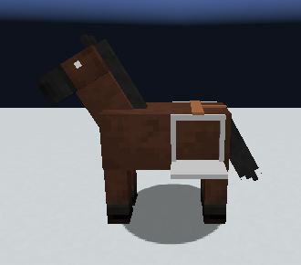
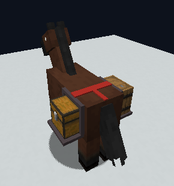

## The storage harness
A horse needs a **storage harness** before it can carry a chest. There are four: **copper, iron, golden and netherite**.

- Craft one from **2 leather, 1 horse hair and 2 ingots** (1 ingot for netherite).
- A better metal makes the load a little lighter.
- The leather **dyes** like leather armour.

## Weight
The more a horse carries, the **slower** it goes. A stronger puller carries more. An **ender chest weighs nothing**. A chest with items in it will not come off the horse.

## If the horse dies
Its chests are **set down as blocks where it fell, with everything still inside**. Everything else it wore drops as items. Selling a horse or turning it loose hands its gear back first.

<!-- MESSAGE 3 -->
ATTACH: crystal-growths.png
ATTACH: boar-tusks.png
ATTACH: sabre-fangs.png
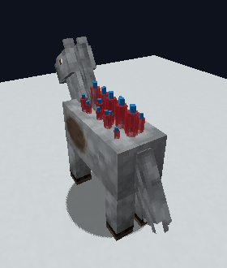
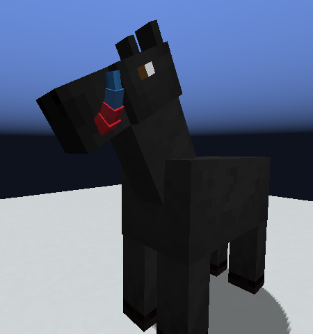
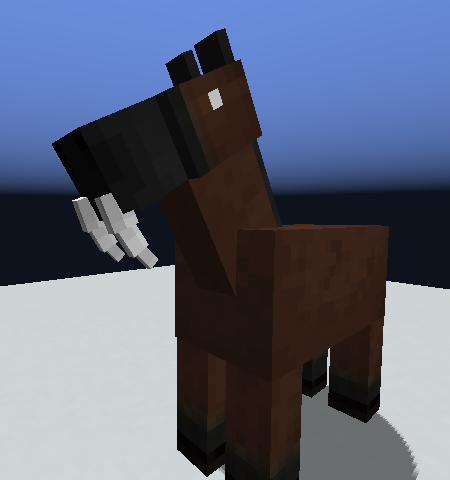

## New things to grow 💎
All of these are **rare** in wild horses, and each is a gene that passes to foals.

- **Crystal growths**: clusters of see-through crystals along the back.
- **Boar tusks** and **sabre fangs**: two more forms of the tusks gene, beside the narwhal horn. A horse with two different forms grows **both**.

<!-- MESSAGE 4 -->
ATTACH: ear-fins.png
ATTACH: cheek-spikes.png
ATTACH: brow-ridge.png
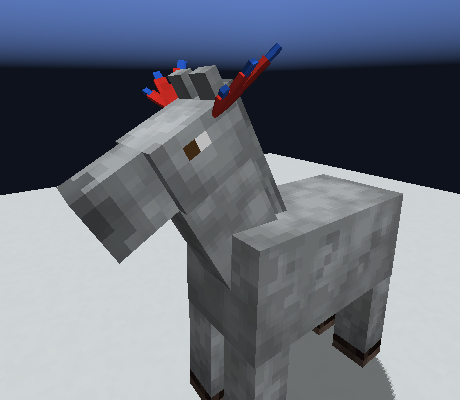
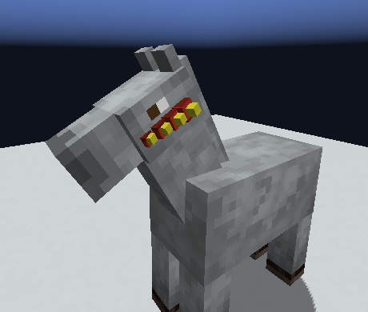
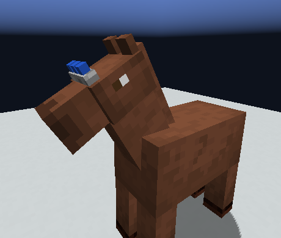

## On the head
- **Ear fins**: a fin behind each ear. It's **recessive**, so two plain horses can have a finned foal.
- **Cheek spikes**: up to four along each cheek.
- **A brow ridge**: plain, notched or spined.

Each has its **own colour gene**.

<!-- MESSAGE 5 -->
ATTACH: horizontal-twist-horns.png
ATTACH: scimitar-horns.png
ATTACH: skeleton-bone-head-parts.png
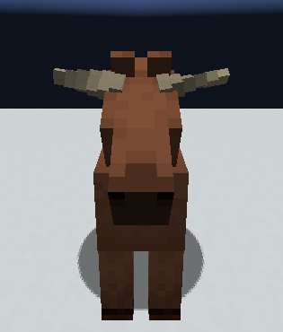
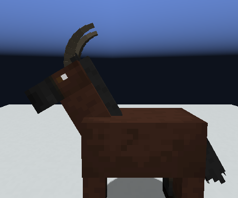
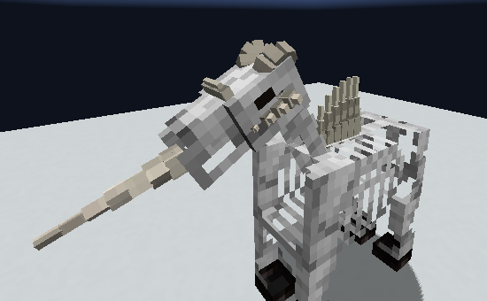

## Two new ram horn shapes 🐏
- **Horizontal twist**: flat, wide horns straight out to the sides, like the old Egyptian ram.
- **Scimitar**: one long blade a side, swept back over the neck, like an ibex.

**Skeleton horses** can grow the cheek spikes and brow ridge in bare bone.

<!-- MESSAGE 6 -->
## A lighter server
Horses with **no player within 128 blocks go dormant**: they think one tick in ten. Hunger, healing, bond, pregnancy and growing up keep their normal pace. Servers can change the distance with `performance.dormancy_radius`.

## Fixes
- Bond earned on a world's **first day** no longer blocks earning on day two.
- A music-loving horse earns bond only **while a record is playing**.
- When a pack leader dies, its followers stop walking to where it stood.

**Not played yet:** the chests and harness pass their tests but nobody has played with them, and the new parts have only been photographed standing still. Tell us what you see! 🎉

**Download:** https://github.com/9-7-8/Procedural-Horse-Coats/releases/tag/v0.5.046
